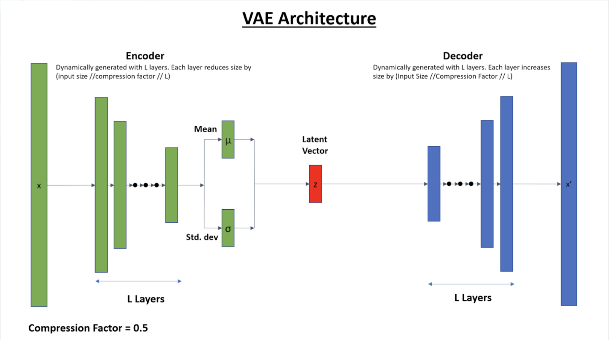

# Learning Hard Quantum Distributions with Variational Autoencoders

## Original Paper

You can find the original paper [here](https://www.nature.com/articles/s41534-018-0077-z).

## Goal

The goal of this project was to analyze how the depth of the neural network (NN) affected the fidelity (measure of
reconstruction accuracy) of resolving compressed quantum many-body states using Variational-Autoencoders (VAEs).

That is, we sample the probability density of the state, given by |Ψ<sub>i</sub> (t)|<sup>2</sup>, and reconstruct this
distribution using the generative model and determine fidelity.

## VAE Architecture



## Project Structure

```
.
├── README.md
├── main.py
├── param
│   └── parameters.json
├── results
└── src
    ├── model
    │   ├── hidden_layers.py
    │   ├── model.py
    │   └── variational_autoencoder.py
    └── utils
        ├── create_dataset.py
        ├── gen_data
        │   ├── gen_hard.py
        │   └── gen_random.py
        ├── get_data.py
        └── library.py
```

## Argparse --help

```
usage: main.py [-h] [-v N] [-n N] [--result result/] [--pretrained False]
               [--param param/param.json]

Learning Hard Quantum States Using a Variational AutoEncoder

optional arguments:
  -h, --help            show this help message and exit
  -v N                  Verbosity (0 = all information, else = nothing).
  -n N                  Number of qubits.
  --pretrained False    Load pretrained model.
  --param param/param.json
                        Parameter file path.
```

## Example Command

```
python3 main.py -v 0 -n 18 --param param/parameters.json --pretrained False
```
